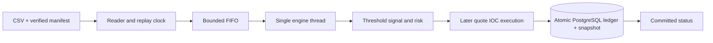

# Architecture and invariants

TickForge is a single-process, single-writer paper venue. The reader owns parsing and pacing; the engine thread owns all market and financial state. `ArrayBlockingQueue` limits pending input. Synchronous database commits provide backpressure. The HTTP server reads an immutable serialized snapshot published only after a successful commit.

Prices, cash, fees and cost basis use integer ticks (10,000 per USD). Arithmetic is checked; invalid arithmetic cancels or rejects the order without partial financial updates. Long-only positions retain acquisition cost including fees; proportional cost removed on a partial sale rounds down in integer ticks. No profit or predictive-value claim is made.

Order identity is the composite `(run_id, physical-index:threshold:0)`. A run-scoped foreign key keeps independent experiments separate while canonical reports omit run IDs for direct comparison. CREATED is the initial state; each change from it is appended to `order_events`. The threshold strategy has no hidden history: holdings and pending orders completely determine its state.

Quotes never trigger signals. A qualifying trade creates an order; only a subsequent same-symbol quote at/after eligibility can fill it. A partial fill immediately cancels the remainder. A quote above a buy cap cancels, a zero-size quote cannot fill, and timeouts are checked before execution on every accepted event. EOF cancels outstanding orders without liquidating holdings.

A repeated/lower feed sequence is audited and ignored. A forward gap fails before checkpoint advancement unless explicitly configured for diagnostic testing. Older timestamps consume their valid next sequence but do not overwrite quotes or advance market time. Malformed rows fail in strict mode; diagnostic quarantine advances the physical checkpoint but not sequence state.

Format v1 requires one physical line per CSV record, an exact header, a maximum of 16,384 characters per record, and no embedded newlines. Oversized records and unreadable UTF-8 are fatal transport errors in all modes. Record count is checked at EOF; the immutable input's exact bytes are hashed before replay. Do not modify input while a run is reading it. Resume revalidates its hash.

Complete snapshots contain sequence/time, quotes, pending orders, positions/costs, cash, fees, counters, next physical index and finalization. No ledger-history arrays are retained in engine memory. Reports intentionally load full histories; use them for bounded demonstration datasets, not unlimited production exports.

Dependencies: [Commons CSV](https://commons.apache.org/proper/commons-csv/), [PostgreSQL session advisory locks](https://www.postgresql.org/docs/current/explicit-locking.html#ADVISORY-LOCKS), [Testcontainers PostgreSQL](https://java.testcontainers.org/modules/databases/postgres/).
