# TickForge: Java market-data replay and paper-execution engine

Design prepared for Roy Luo, 2026-09-12. Status: proposed; no implementation or benchmark results exist yet. Working name only; uniqueness has not been checked.

## 1. Objective and scope

Build a reproducible local system that consumes recorded equity quote/trade events, maintains market state, turns a simple signal into simulated orders, and survives interruption without changing the final trading ledger. The primary deliverable is credible Java systems engineering, not an investment strategy or a profit claim.

The interview demonstration should answer: Can you model state clearly, process data correctly, control concurrency, reason about database failures, measure performance, and explain your tradeoffs?

Version 1: one Java process, one ordered input file, one simulated venue, USD equities, top-of-book quotes, integer share quantities, market orders with immediate-or-cancel simulation, PostgreSQL persistence, and a local metrics endpoint. Start with generated fictional symbols such as TEST_A and TEST_B. A seeded synthetic generator makes the entire example distributable without a market-data subscription. Clearly label synthetic data. An optional adapter for lawfully obtained recorded equities data comes after the core works; do not describe normalized synthetic events as a native exchange protocol.

Exclude live trading, account credentials, short selling, leverage, full depth/order-book matching, limit orders, corporate actions, exchange calendars, multiple feeds, distributed workers, Kubernetes, Kafka, Redis, ML, and a polished frontend from version 1. These exclusions keep the reliability contract tractable.

## 2. Technology decisions

| Component | Choice | Reason |
|---|---|---|
| Runtime | Java 21, pinned distribution/patch at implementation | Stable language baseline with records, sealed interfaces, standard concurrency tools |
| Build | Maven Wrapper | Reproducible local and CI commands; separate JMH benchmark module later |
| Core | Plain Java; explicit constructor dependencies | Keeps state transitions visible and independently testable |
| Parser | Documented CSV using a maintained CSV library | Establish correctness first; measure before specializing parsing |
| Queue | ArrayBlockingQueue, configurable bounded capacity | Explicit producer backpressure with simple ownership |
| Persistence | PostgreSQL, JDBC, versioned SQL migrations | Explicit transaction boundaries, constraints and query plans |
| Tests | JUnit; PostgreSQL Testcontainers integration tests | Pure deterministic tests plus actual database semantics |
| Operations | Docker Compose, shell scripts, JSON logs, metrics endpoint | A reviewer can run, interrupt and inspect the application |
| Measurement | JMH for isolated core work; separate whole-system replay harness | Separates microbenchmarks from database-inclusive measurements |

Choose and pin compatible library and image versions during implementation, including test/build plugins. The choices above are design recommendations, not claims that dependencies have been resolved. Keep secrets outside Roy OS; local connection settings come from runtime environment configuration.

Java's bounded queue blocks producers on a full queue when using put; see [ArrayBlockingQueue documentation](https://docs.oracle.com/en/java/javase/21/docs/api/java.base/java/util/concurrent/ArrayBlockingQueue.html). PostgreSQL transactions provide the commit boundary used below; see [transaction documentation](https://www.postgresql.org/docs/current/tutorial-transactions.html). Use the official [Testcontainers PostgreSQL module](https://java.testcontainers.org/modules/databases/postgres/) and [JMH documentation](https://github.com/openjdk/jmh) when implementing tests and benchmarks.

## 3. Architecture and thread ownership

```mermaid
flowchart LR
    A[Immutable event file + manifest] --> B[Reader / parser / replay clock]
    B --> C[Bounded FIFO queue]
    C --> D[Single engine thread]
    D --> E[Validate sequence and update quote cache]
    E --> F[Strategy and risk checks]
    F --> G[Paper execution and ledger]
    G --> H[Atomic batch commit to PostgreSQL]
    H --> I[Publish immutable committed status]
    I --> J[Read-only status and metrics]
```



- Producer thread owns file parsing and pacing. Each physical record becomes an envelope, including invalid records. It cannot change trading state.
- Engine thread exclusively owns quotes, strategy history, pending orders, sequence state, cash and positions. Use ordinary maps inside this boundary. Do not put ConcurrentHashMap everywhere or create a thread per symbol.
- Database writes occur synchronously on the engine thread in version 1. A slow commit naturally fills the queue and slows the replay producer. This deliberately favors a simple correctness model; benchmark the cost.
- HTTP/metrics thread reads an immutable snapshot published only after commit. It does not mutate the engine or expose uncommitted positions. Operational counters may be live and must be distinguished from committed financial state.
- The engine holds a PostgreSQL session advisory lock for its run on the same connection used for writes. A second instance fails fast. A lost connection aborts processing; reconnect only through recovery and lock acquisition. This is a local single-writer guarantee, not a distributed failover design.

## 4. Data contract

An immutable UTF-8 CSV begins with:

```text
sequence,event_time_ns,symbol,type,bid_ticks,bid_size,ask_ticks,ask_size,trade_ticks,trade_size
1,1000000000,TEST_A,QUOTE,1000000,100,1000200,100,,
2,1010000000,TEST_A,TRADE,,,,,1000100,10
```

All examples are synthetic. Price scale: 10,000 ticks per dollar, so 1,000,000 ticks is $100. Store prices and money as long integer ticks; use checked addition/multiplication to reject overflow. Quantities are positive integer shares. Fees are a configurable nonnegative number of ticks per filled share. Never use binary floating point for ledger arithmetic.

Manifest: format version, generator version, seed, record count, symbol list, price scale, file SHA-256 and provenance/license. Hash the exact input bytes. The run also records configuration hash and engine build ID. Resuming with changed input, configuration, or an incompatible engine build is rejected.

Distinguish three coordinates:

1. Physical record index: monotonically increasing row number, including invalid rows. This is the durable replay checkpoint.
2. Feed sequence: globally increasing across this single normalized feed, not per symbol. A real adapter must define its own mapping before use.
3. Event timestamp: used for deterministic market time and replay pacing. It does not determine file order.

Process in file order; never sort input and accidentally hide bad arrival ordering. The default strict policy halts on a missing forward sequence. A clearly labeled test-only gap-tolerant mode may skip the gap and log it; do not benchmark one mode and claim the other. Repeated or lower sequence numbers are ignored with an audit reason. For each valid next sequence, a timestamp below the last accepted event time is quarantined and consumes that sequence. Equal timestamps are allowed; physical record index breaks ties.

Malformed records in strict mode halt before advancing the checkpoint. A diagnostic quarantine mode records the physical index/reason and advances the physical checkpoint; if sequence cannot be read, the next gap remains subject to the gap policy. No invisible data loss.

Quote validation: known symbol, nonnegative timestamp, positive prices, nonnegative sizes, bid <= ask, valid field combinations. Trade validation: positive price and quantity. Unknown types, negative sizes, overflow and crossed quotes have explicit outcomes. Zero available quote size is valid but cannot fill an order. Duplicate rows cannot produce duplicate signals.

## 5. Domain model and module boundaries

Suggested package layout within one core Maven module:

```text
io/          CsvEventReader, ReplayScheduler, EventEnvelope, DatasetManifest
domain/      MarketEvent, QuoteEvent, TradeEvent, Quote, Order, Fill, Position
engine/      TradingEngine, EngineState, BatchResult, Checkpoint
strategy/    SignalStrategy, ThresholdStrategy, StrategyState
risk/        RiskPolicy, RiskDecision
execution/   PaperVenue, OrderTransition
persistence/ JdbcRunRepository, StateSnapshotCodec, SchemaMigration
ops/         StatusServer, Metrics, JsonLog
cli/         Main, RunConfig
```

Use records for immutable input/output values and a sealed interface for event variants. Keep persistence and transport details out of strategy code. Introduce interfaces at actual replaceable boundaries, not an interface for every class.

Conceptual contracts:

```java
interface SignalStrategy {
    List<OrderIntent> onEvent(MarketEvent event, MarketView market,
                             PortfolioView portfolio, StrategyState state);
}
interface RunRepository {
    RecoveredRun loadForResume(RunId runId);
    void commitBatch(BatchResult batch, EngineSnapshot completeSnapshot);
}
```

The strategy has no database, clock or network access. Pass deterministic event time. Order IDs derive from run ID, triggering physical record index, strategy ID and intent ordinal. Run ID changes for an independent experiment but remains fixed during recovery. No random UUIDs inside state transitions. Store a configured random seed if adding randomness later.

## 6. Strategy, risk and execution behavior

Use a simple fixed-threshold long-only strategy solely to exercise the pipeline. Each symbol has configured entry and exit price thresholds. On a trade at or below entry, request a buy if flat and no outstanding order; on a trade at or above exit, request a sell if holding and no outstanding order. Forbid entry >= exit at configuration load. Size is fixed and configurable. A pure function or tiny state machine is sufficient; no claim of predictive edge.

Before acceptance, enforce symbol allowlist, fresh available quote, maximum order quantity, maximum per-symbol position, cash sufficient for a worst-case permitted buy plus fees, no selling beyond holdings, and at most one active order per symbol. Buy orders carry a maximum acceptable fill price fixed at acceptance; a subsequent quote above that cap produces no fill. Evaluate quantities and available cash again at execution. Persist reject reasons.

State transitions:

```text
CREATED -> REJECTED
CREATED -> ACCEPTED -> FILLED
                   -> PARTIALLY_FILLED -> CANCELLED
                   -> CANCELLED
```

Every transition is an append-only order event; current order status is a materialized row. Rejection, fill and cancellation are terminal in version 1; terminal orders cannot change again. The partial-fill event followed by cancellation expresses IOC remainder cancellation. Position changes only on fills.

Execution rules:

- An accepted order can fill only on a later physical record containing a quote for the same symbol, at or after trigger event time plus configured simulated latency. Zero configured latency still cannot fill on the triggering record.
- Buy at that later quote's ask; sell at its bid. Fill no more than the displayed relevant size, requested quantity, and current risk allowance. Deduct fees. Cancel an unfilled remainder immediately.
- The single-outstanding-order rule avoids reusing the same displayed liquidity across multiple pending orders for one symbol. No hidden liquidity or queue position is modeled.
- Expire a pending order after an event-time timeout, checked on every accepted event. At end of input, cancel all pending orders using a deterministic finalization transaction. Do not invent a final fill or liquidate holdings automatically.
- Quote freshness uses event time, never wall-clock time. Persist the last quote timestamp and strategy state. Trade prints drive signals but never provide executable bid/ask liquidity.
- Report final cash, positions, fees, fill count and rejection counts. A mark-to-market valuation may use the final midpoint but must flag missing/stale marks; it is not realized cash.

The simulation omits impact, venue matching, transport timing and many real execution effects. Explain these limitations in the README. Correct deterministic behavior is the success criterion.

## 7. Persistence schema and recovery

Suggested tables (all run-scoped foreign keys enforced):

| Table | Key and contents |
|---|---|
| runs | run_id PK; dataset/config hashes, config JSON, build ID, status, creation time |
| checkpoints | run_id PK/FK; next physical index, snapshot version, complete state JSONB, finalized flag |
| event_outcomes | PK(run_id, physical_index); feed sequence if readable, type, disposition, reason |
| orders | PK(run_id, order_id); symbol, side, quantity, filled quantity, status, trigger index, cap, expiry |
| order_events | PK(run_id, order_id, transition_index); from/to state, cause index, reason |
| fills | PK(run_id, order_id, fill_index); execution index, price ticks, quantity, fee ticks |
| positions | PK(run_id, symbol); quantity and cost state |
| account_state | run_id PK/FK; cash ticks and accumulated fees |

Add checks for positive quantities, nonnegative fill counts, filled quantity <= order quantity, allowed status values, and valid foreign keys. Add an index on orders(run_id, symbol, trigger_index) for the demo history query and fills(run_id, execution_index) for chronological exports. Measure with EXPLAIN ANALYZE on a generated larger run before adding more indexes. A quote cache is the in-memory map; the durable complete snapshot is its recovery source, not a Redis service.

The full snapshot contains quotes, last accepted sequence/time, strategy state, outstanding orders, positions, cash, counters needed for deterministic IDs and the next physical index. Version the serialization format. Store both normalized ledger changes and the snapshot in the same transaction. For this small symbol universe, a complete snapshot each batch is an acceptable starting tradeoff; measure its cost before designing incremental snapshots.

Commit every configurable N physical records, and flush at EOF. Default N=100 is a starting configuration, not a performance claim. Never use wall-clock batch boundaries for deterministic trading behavior. State changes are provisional until commit.

```text
Acquire run lock and verify dataset/config/build compatibility.
Restore all state from the committed snapshot (or initialize a new run).
Read from checkpoint.nextPhysicalIndex.
Process up to N records on the sole engine thread.
BEGIN
  insert event outcomes and order transitions;
  insert/update current orders, fills, positions and cash;
  write the COMPLETE engine snapshot and next physical index;
COMMIT
Publish the committed immutable status snapshot.
```

On SQL failure, do not continue with provisionally mutated memory. Stop, reacquire the lock on a fresh connection, reload the committed snapshot and restart the reader. A lost COMMIT acknowledgement is an ambiguous commit, not proof of rollback: read the checkpoint after reconnecting to determine whether the batch committed. Never blindly resend external effects. There are no external orders in this project.

Database constraints are a backstop; blindly ignoring duplicate inserts with ON CONFLICT DO NOTHING can hide inconsistent state and is not the recovery algorithm. Duplicate-source handling and same-run crash replay must be tested separately.

EOF finalization cancels pending orders, writes the final snapshot and marks the run complete in one transaction. Repeated resume of a complete run is a no-op. Wall-clock run timestamps and operational metrics may differ after restart; deterministic comparisons exclude them and include business state and event lineage.

Claim only: replay can reread records, while committed simulated effects remain unique within the tested single-database run. Do not claim end-to-end exactly-once trading or production readiness.

## 8. Queue, overload and shutdown

Start with capacity 8,192 and measure other sizes. In file replay, use timed offer with repeated shutdown checks; a full queue waits and records blocked time instead of dropping events. Do not hold a database lock that the producer needs. On engine failure, cancel/interrupt the producer so it cannot hang on a full queue. Fatal parser errors propagate explicitly to the engine.

Paced mode maps nondecreasing event-time deltas to a monotonic local clock; speed factor controls replay only. Max-speed mode removes deliberate waits. Out-of-order timestamps never create a negative sleep. Neither pacing nor machine speed changes strategy time or final results.

On SIGTERM, stop accepting new input, complete and commit the current engine batch, discard any uncommitted queued remainder, and close resources. On SIGKILL, resume from the committed checkpoint. Document that this is replay backpressure; a future live feed cannot necessarily slow its upstream source and would need an explicit overload policy.

## 9. Tests with meaningful acceptance criteria

| Test | Required result |
|---|---|
| Parser/price arithmetic | Exact ticks; malformed fields and overflows rejected |
| Duplicate and older sequence | Audited ignore; no extra signal, order or fill |
| Sequence gap | Strict run halts; diagnostic mode is explicit |
| Older timestamp | Quarantine according to policy; latest quote remains correct |
| Stale/crossed/zero-size quote | No invalid fill; reason visible |
| No lookahead | A later record is required for a fill even with zero latency |
| Risk checks | Buy cash and position caps hold; no naked sell; fees included |
| IOC fill | Limited by displayed size; remainder cancelled once |
| Queue overload | Bounded memory, producer blocking, no silent loss, clean cancellation |
| Before-commit crash | Recovery produces baseline ledger and final state |
| After-commit/before-publish crash | No duplicate committed outcomes or fills |
| Ambiguous commit | Recovery reads checkpoint; never assumes rollback |
| EOF crash | Final cancellation occurs once; completed resume is a no-op |
| Changed input/config | Resume refused before processing |
| Two processes, same run | Second writer cannot acquire run lock |
| Batch size/pacing changes | Same canonical business output across supported settings |

Use fixed tiny fixtures with manually computed expected results, then seeded generated streams. For recovery tests launch a child JVM and terminate it at explicit fault-injection points; comparing an ordinary method exception is insufficient to establish process crash recovery. Test actual PostgreSQL commits using Testcontainers. The comparison checks orders, transition sequence, fills, cash, positions, final state and checkpoint, not just row counts. Normalize run ID across independent baseline runs when comparing derived order identifiers. Exclude wall-clock metadata.

## 10. Benchmark and observability plan

Measure three distinct paths:

1. JMH isolated parser and core transitions, with documented warmup, forks and consumed outputs. Avoid measuring only dead-code-eliminated work.
2. Whole-system max-speed replay with database commits, reporting committed records/sec, queue occupancy, producer blocked time, commit latency and maximum memory.
3. Paced offered-load replay at several target rates, reporting actual offered rate, completed rate, scheduled-arrival-to-commit latency and missed schedule time. When producer backpressure prevents sustaining the offered load, report that rather than hiding the delay.

Use monotonic timing for elapsed durations. Event timestamps are simulated market time, not a valid clock for wall-clock processing latency. Track separately: queue wait, engine processing, database commit and first-admission-to-commit latency. For each committed batch, attribute completion time to each record; do not omit time waiting for a batch flush. Label in-memory figures separately from durable end-to-end figures.

Record hardware, OS, JDK, heap/GC settings, commit/build ID, Docker/native database placement, input hash and size, symbol distribution, warmup, repeats, batch size, queue capacity, strictness mode and output checksum. Report p50/p95/p99 plus maximum and throughput; never imply a target is an achieved result. Try batch sizes 1/100/1000 and queue capacities 1024/8192/65536 only after correctness passes. Change one variable per comparison and keep business-output equality checks.

Expose /health/live, /health/ready, /status and /metrics bound to localhost by default. Readiness is false until run lock and recovery complete, and on fatal error. Metrics: parsed/committed/rejected/duplicate records, queue depth, blocked duration, commit latency/failures, order outcomes, recovery count and last committed index. Use structured logs with run ID, physical index, sequence and reason. Avoid a log line per valid quote under load. Include a documented alert example for commit failures or a running replay whose committed index stops advancing; do not call it production monitoring until demonstrated.

## 11. Repository and commands to implement

```text
tickforge/
  README.md
  pom.xml, mvnw, .mvn/
  engine/src/main/java/...
  engine/src/main/resources/db/migration/
  engine/src/test/java/...
  benchmarks/                      # add after core is correct
  fixtures/                       # tiny synthetic CSV + manifests
  config/demo.yaml
  scripts/demo.sh, verify-recovery.sh, benchmark.sh
  Dockerfile, compose.yaml
  .github/workflows/ci.yml
  docs/architecture.md, recovery.md, benchmark-results.md
```

Proposed CLI (not available yet):

```sh
./mvnw verify
docker compose up -d db
./scripts/demo.sh
java -jar engine.jar generate --seed 42 --events 100000 --output data/demo.csv
java -jar engine.jar replay --input data/demo.csv --config config/demo.yaml --run-id demo-001
java -jar engine.jar resume --run-id demo-001
java -jar engine.jar report --run-id demo-001 --format json
./scripts/verify-recovery.sh
./scripts/benchmark.sh
```

Scripts use strict error handling, quote paths, propagate exit codes, and clean up only resources they created. Generate local configuration outside tracked source for secrets. CI builds on Linux, checks formatting, runs unit and real-Postgres integration tests, packages the application and performs a Docker smoke replay. CI is for correctness; run serious performance measurements on a documented stable machine. Preserve raw benchmark output and run metadata.

## 12. Build sequence and definition of done

The earlier five-to-seven-day estimate applies to a small first demonstration if Java is already comfortable. The full recovery and measurement scope below is a larger project: plan approximately 30-50 focused hours if comfortable with Java and SQL, longer if learning them. This is an estimate, not a deadline. Apply with existing experience rather than waiting indefinitely.

| Step | Approximate effort | Exit criterion |
|---|---|---|
| 1. Contract and parser | 3-5 hours | Seeded fixture, exact arithmetic, malformed/duplicate/ordering tests |
| 2. In-memory engine | 5-8 hours | Deterministic strategy, risk, fills and manually verified ledger |
| 3. Persistence and recovery | 8-14 hours | Atomic snapshot/ledger, process-kill recovery and writer exclusion |
| 4. Queue and lifecycle | 4-6 hours | No silent drops, bounded queue, failure propagation and shutdown tests |
| 5. Docker, scripts, CI, status | 4-7 hours | Fresh local setup and Linux CI both run a full replay |
| 6. Benchmarks and write-up | 6-10 hours | Reproducible results and one evidence-backed improvement |

First session: implement records, parser, QuoteCache and a ten-record fixture with three assertions: valid quote updates, duplicate does not update, older event does not overwrite. Explain the code before expanding it.

Final demonstration: run a baseline; start a second run and kill it mid-batch; resume; show matching canonical ledger checksums and positions; show invalid-input audit reasons; show the measured effect of batch size on throughput and commit latency. Keep the recording around two minutes and link exact reproduction commands.

Definition of done: meaningful tests pass, clean setup works, recovery matches baseline at each fault boundary, benchmarks disclose their conditions, no claimed result lacks evidence, and Roy can explain all core mechanisms without reading a generated script. A personal project can demonstrate Java ability; it does not become professional Java experience.

## 13. Resume integration when complete

Replace Unrender with TickForge after the engine and recovery tests actually work. Keep RUSHES as complementary existing backend work. Future bullet templates below are NOT current accomplishments:

- Built a Java market-data replay and paper-execution engine with a bounded event queue, in-memory quote cache, and PostgreSQL persistence; implemented deterministic order transitions and transactionally checkpointed recovery.
- Verified crash recovery against uninterrupted runs and benchmarked [measured committed records/sec] at [measured p99 admission-to-commit latency] on [documented setup]; automated integration tests with [tools actually used].

Do not fill placeholders with estimates. If benchmark numbers are not stable, use the verified recovery result and named engineering mechanisms instead. Do not label the project low-latency until measured, or imply connection to Point72, production exchanges or live capital.

Role context: [Point72 official internship posting](https://job-boards.greenhouse.io/point72/jobs/8721562002), inspected 2026-09-12. The project is an independent recommendation aligned with the posting, not Point72's disclosed architecture or an interview assignment.
