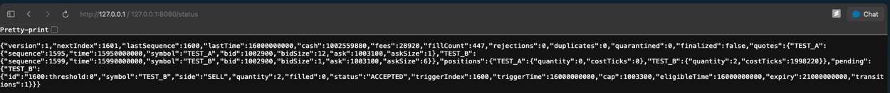

# Reviewer guide

TickForge is a local Java 21 engineering demonstration: ordered synthetic market data, deterministic paper execution, and PostgreSQL crash recovery. There is no graphical trading dashboard or live broker connection. The browser pages expose JSON state and operational metrics.

## Start here

1. Read [architecture and invariants](architecture.md), then trace [TradingEngine](../engine/src/main/java/dev/tickforge/engine/TradingEngine.java), [ReplayRunner](../engine/src/main/java/dev/tickforge/engine/ReplayRunner.java), and [JdbcRunRepository](../engine/src/main/java/dev/tickforge/persistence/JdbcRunRepository.java).
2. Inspect the [recovery contract](recovery.md) and [process-level tests](../engine/src/test/java/dev/tickforge/persistence/ProcessRecoveryIT.java). Check the crash points against the transaction/publication order rather than relying on a successful demo.
3. Read [measured results and limitations](benchmark-results.md), including the linked raw runs. Durable throughput and isolated JMH measurements answer different questions.
4. Read the [prior all-code review](review.md), which records fixes and remaining change-size advisories. This was an agent-assisted review, not independent human approval.

The integrated engine at `268def8adbee136f7172d5dc9aaa67c79faae8c3` passed [main CI](https://github.com/ryouol/tickforge/actions/runs/34725398693): formatting, Maven verification, process recovery tests, container replay, and the benchmark smoke matrix. This walkthrough adds documentation and capture evidence; it does not change engine behavior.

## Run an inspectable one-hour demo

From the repository root, use Java 21 and a running Docker daemon. For a new database, generate and retain a password as described in the [quick start](../README.md#quick-start). If an ignored `.env` already contains the database settings, export those existing values before running Java:

```sh
set -a
. ./.env
set +a
```

Do not generate a replacement password for an existing database volume. On macOS, `export JAVA_HOME=$(/usr/libexec/java_home -v 21)` and `export PATH="$JAVA_HOME/bin:$PATH"` select an installed Java 21 JDK. Confirm with `java -version`.

```sh
docker compose up -d --wait db
./mvnw -B -ntp spotless:check verify
mkdir -p data
RUN_ID="review-$(date +%Y%m%d-%H%M%S)-$$"
printf '%s\n' "$RUN_ID" > data/review-run-id.txt
java -jar engine/target/engine-1.0.0-SNAPSHOT.jar generate \
  --seed 42 --events 180000 --output "data/$RUN_ID.csv"
java -jar engine/target/engine-1.0.0-SNAPSHOT.jar replay \
  --input "data/$RUN_ID.csv" --config config/demo.yaml --run-id "$RUN_ID" \
  --batch-size 100 --queue-capacity 1024 --speed 0.5 --port 8080
```

The generated input advances 10 ms per event; half-speed pacing offers about 50 events/s for one hour. Replay stays in the foreground until EOF or Ctrl+C. If port 8080 is occupied, choose another `--port` and use it in the URLs below. Database port overrides require both `TICKFORGE_DB_PORT` and the matching `TICKFORGE_DB_URL`.

While replay runs, open these URLs in a browser or another terminal. Enable the browser's **Pretty-print** option for JSON, if available, and refresh to observe changes.

| Endpoint | What to inspect |
| --- | --- |
| [Readiness](http://127.0.0.1:8080/health/ready) | `ready: true` after recovery and writer-lock acquisition. |
| [Committed state](http://127.0.0.1:8080/status) | `nextIndex` advances; `fillCount`, positions, and cash reflect committed batches. Money is ticks: divide by 10,000 for USD. Cash alone is not P&L. |
| [Metrics](http://127.0.0.1:8080/metrics.json) | `committed` advances, `commitFailures` stays zero, and `queueDepth` remains bounded. Timings are nanoseconds. |
| [Prometheus text](http://127.0.0.1:8080/metrics) | The same operational instrumentation in scrape format. |

A full 100-event batch publishes roughly every two seconds at this pacing. `/status` and `/metrics.json` are sampled separately and are not an atomic combined snapshot. These URLs refer to the reviewer's own computer, and close when replay exits; PostgreSQL retains the run.

After Ctrl+C, use the original input, manifest, configuration, and **same jar** to resume. Do not rebuild between interrupting and resuming: build compatibility hashes the actual artifact.

```sh
RUN_ID=$(cat data/review-run-id.txt)
java -jar engine/target/engine-1.0.0-SNAPSHOT.jar resume \
  --run-id "$RUN_ID" --speed 0.5 --batch-size 100 --queue-capacity 1024 --port 8080
# After replay/resume exits, export the complete canonical ledger:
java -jar engine/target/engine-1.0.0-SNAPSHOT.jar report \
  --run-id "$RUN_ID" --format json > "data/$RUN_ID.report.json"
```

For automated crash and ambiguous-commit checks, run `./scripts/verify-recovery.sh`; this rebuilds the app and uses isolated test containers. Run it before starting a manual recovery experiment, or after completing that experiment. Stop the demo database with `docker compose stop db` after stopping replay; this preserves its volume.

## Screenshots

The following is a browser capture of `/status` from `review-demo-20260912-225952`, captured on September 13, 2026 UTC (September 12 in Toronto). It shows checkpoint 1601 and 447 simulated fills. The crop excludes unrelated browser tabs; response content is unaltered. The machine-readable sample below was collected later in the same run, so its counters differ. This is the engine’s JSON endpoint, not a graphical dashboard.



## Evidence and review questions

[Local capture data](evidence/local-demo.json) records the run ID, UTC capture time, replay settings, readiness, two advancing checkpoints, committed state, and metrics from the running engine. It contains synthetic financial data. A successful sample is smoke-test evidence, not a performance or recovery guarantee.

Review these boundaries in particular:

- Does a failed or ambiguously acknowledged commit always end the writer, with restart restoring authoritative database state?
- Are order IDs, duplicate handling, input validation, and EOF cancellation deterministic across batch sizes and restarts?
- Do risk checks and checked arithmetic cover partial fills, fees, cash, and execution eligibility without partial financial mutations?
- Are queue capacity, snapshot size, and report streaming bounded with increasing history?
- Do the test assertions establish the stated guarantees, and do benchmark comparisons preserve configuration and report format?

Production concerns remain out of scope: live-feed normalization, venue reconciliation, authentication, deployment hardening, monitoring operations, backups/restore validation, and realistic execution modeling. This repository is ready for engineering review, not certified for production use.
